# Semantic Topic Cluster Plan — KayaSadhak

> **Pillar Topic:** Personal Home Yoga Instruction & Certified Wellness Ecosystem (Delhi NCR & Chandigarh Tricity)  
> **Methodology:** SERP Overlap Analysis (Top-10 Organic Shared Result Thresholding)  
> **Canonical Domain:** `https://www.kayasadhak.com`  
> **Version:** 1.9.0

---

## 1. Executive Summary & Cluster Architecture

KayaSadhak’s content ecosystem is designed around a central high-intent commercial pillar page supported by **5 specialized spoke clusters** (20 spoke pages total).

```mermaid
graph TD
  P["PILLAR: Personal Home Yoga Hub<br/>(/services/yoga-at-home)"]

  C1["Cluster 1: Pricing & Onboarding"]
  C2["Cluster 2: Demographic & Lifestyle"]
  C3["Cluster 3: Therapeutic Care"]
  C4["Cluster 4: Locality Footprint"]
  C5["Cluster 5: YTT & Ashrams"]

  P --- C1
  P --- C2
  P --- C3
  P --- C4
  P --- C5

  C1 --> S1["Pricing Matrix (/pricing)"]
  C1 --> S2["Personal Fitness (/services/personal-fitness-trainer)"]
  C1 --> S3["Free Trial Funnel (/book-a-free-class)"]

  C2 --> S4["Corporate Yoga (/services/corporate-yoga)"]
  C2 --> S5["Senior Yoga (/services/senior-citizen-yoga)"]
  C2 --> S6["Kids Yoga (/services/kids-yoga)"]
  C2 --> S7["Prenatal Yoga (/services/prenatal-postnatal-yoga)"]

  C3 --> S8["Back Pain (/yoga-for-conditions/back-pain)"]
  C3 --> S9["PCOD/PCOS (/yoga-for-conditions/pcod-pcos)"]
  C3 --> S10["Thyroid (/yoga-for-conditions/thyroid)"]
  C3 --> S11["Weight Loss (/yoga-for-conditions/weight-loss)"]

  C4 --> S12["South Delhi (/yoga-teacher-at-home/delhi/south-delhi)"]
  C4 --> S13["East Delhi (/yoga-teacher-at-home/delhi/east-delhi)"]
  C4 --> S14["North Delhi (/yoga-teacher-at-home/delhi/north-delhi)"]
  C4 --> S15["West Delhi (/yoga-teacher-at-home/delhi/west-delhi)"]
  C4 --> S16["Sector 45 Studio (/studio-noida-sector-45)"]

  C5 --> S17["200-Hour TTC (/yoga-teacher-training/200-hour-ttc)"]
  C5 --> S18["300-Hour TTC (/yoga-teacher-training/300-hour-ttc)"]
  C5 --> S19["500-Hour TTC (/yoga-teacher-training/500-hour-ttc)"]
  C5 --> S20["Rishikesh Ashram (/yoga-teacher-training/locations/rishikesh)"]
```

---

## 2. Pillar Page Specifications

| Attribute | Specification |
|---|---|
| **URL** | `https://www.kayasadhak.com/services/yoga-at-home` |
| **Primary Keyword** | `personal yoga teacher at home delhi ncr` (Est. Volume: 2,800/mo) |
| **Secondary Keywords** | `yoga instructor at home`, `private yoga classes delhi`, `female yoga teacher at home` |
| **Search Intent** | Commercial Investigation / High-Intent Transactional |
| **Content Template** | `ultimate-guide` (3,500+ words) |
| **Mandatory Outbound Links** | Links to every spoke post across all 5 clusters |
| **Structured Data** | `Service`, `HealthAndBeautyBusiness`, `OfferCatalog`, `FAQPage`, `BreadcrumbList` |

---

## 3. Spoke Clusters & Template Mapping

### Cluster 1: Transparent Pricing, Tiers & Onboarding
*Targeting budget, tier credentials, and direct booking inquiries.*

1. **Home Yoga Pricing: Silver, Gold & Platinum Tier Breakdown**
   - **URL:** `/pricing` | **Intent:** Commercial (`comparison`) | **Target Keyword:** `yoga teacher at home cost in delhi` (1,600/mo)
   - **Key Focus:** Transparent ₹500/₹750/₹1,000 rates, monthly packages, zero hidden travel charges.
2. **Personal Fitness Trainer at Home vs Yoga Instructor**
   - **URL:** `/services/personal-fitness-trainer` | **Intent:** Transactional (`landing-page`) | **Target Keyword:** `personal fitness trainer at home delhi` (1,200/mo)
   - **Key Focus:** Functional fitness, strength conditioning at home, equipment-free routine.
3. **Book a Free 1-on-1 Home Yoga Trial Session**
   - **URL:** `/book-a-free-class` | **Intent:** Transactional (`landing-page`) | **Target Keyword:** `free trial yoga class at home delhi` (950/mo)
   - **Key Focus:** 4-step interactive booking funnel, locality matching, teacher gender preference.

---

### Cluster 2: Demographic & Lifestyle Home Yoga
*Targeting specific demographic segments and corporate wellness contracts.*

1. **Corporate Yoga & Employee Desk Wellness in Delhi NCR**
   - **URL:** `/services/corporate-yoga` | **Intent:** B2B Commercial (`landing-page`) | **Target Keyword:** `corporate yoga classes delhi ncr` (880/mo)
2. **Gentle Mobility & Chair Yoga for Senior Citizens at Home**
   - **URL:** `/services/senior-citizen-yoga` | **Intent:** Informational / Commercial (`explainer`) | **Target Keyword:** `yoga for senior citizens at home delhi` (720/mo)
3. **Kids & Teen Yoga at Home: Posture & Exam Focus**
   - **URL:** `/services/kids-yoga` | **Intent:** Informational / Commercial (`how-to`) | **Target Keyword:** `kids yoga classes at home delhi` (650/mo)
4. **Doctor-Guided Prenatal & Postnatal Yoga at Home**
   - **URL:** `/services/prenatal-postnatal-yoga` | **Intent:** Commercial / Care (`ultimate-guide`) | **Target Keyword:** `prenatal yoga teacher at home delhi` (1,100/mo)

---

### Cluster 3: Therapeutic Condition Management
*Targeting clinical search queries with medical disclaimers and structured asana protocols.*

1. **Therapeutic Yoga for Chronic Back Pain & Sciatica Relief**
   - **URL:** `/yoga-for-conditions/back-pain` | **Intent:** Informational (`how-to`) | **Target Keyword:** `yoga for back pain at home delhi` (1,900/mo)
2. **Pelvic Alignment & Hormone Regulating Yoga for PCOD/PCOS**
   - **URL:** `/yoga-for-conditions/pcod-pcos` | **Intent:** Informational (`explainer`) | **Target Keyword:** `yoga for pcod and pcos at home` (1,500/mo)
3. **Endocrine Balancing Yoga Therapy for Thyroid Health**
   - **URL:** `/yoga-for-conditions/thyroid` | **Intent:** Informational (`explainer`) | **Target Keyword:** `yoga for thyroid at home delhi` (1,300/mo)
4. **Dynamic Yoga & Core Metabolic Boost for Weight Loss**
   - **URL:** `/yoga-for-conditions/weight-loss` | **Intent:** Commercial / Informational (`best-of`) | **Target Keyword:** `yoga for weight loss at home delhi` (2,400/mo)

---

### Cluster 4: Delhi-NCR & Tricity Locality Footprint
*Targeting local geographic "near me" searches with zero keyword cannibalization.*

1. **Personal Yoga Teacher at Home in South Delhi** — `/yoga-teacher-at-home/delhi/south-delhi` (GK, Hauz Khas, Saket, Vasant Kunj)
2. **Personal Yoga Teacher at Home in East Delhi** — `/yoga-teacher-at-home/delhi/east-delhi` (Mayur Vihar, Preet Vihar, Laxmi Nagar)
3. **Personal Yoga Teacher at Home in North Delhi** — `/yoga-teacher-at-home/delhi/north-delhi` (Rohini, Pitampura, Model Town)
4. **Personal Yoga Teacher at Home in West Delhi** — `/yoga-teacher-at-home/delhi/west-delhi` (Dwarka, Janakpuri, Punjabi Bagh)
5. **Yoga Studio in Sector 45 Noida & Home Classes** — `/studio-noida-sector-45` (BJ Residency, Sadarpur Main Rd, group & private)

---

### Cluster 5: Yoga Teacher Training & Ashram Hubs
*Targeting career seekers, certification students, and residential ashram retreats.*

1. **200-Hour Foundation Yoga Teacher Training Course (YTT)** — `/yoga-teacher-training/200-hour-ttc` (IFY & Yoga Alliance USA tie-up)
2. **300-Hour Advanced Yoga Teacher Training Certification** — `/yoga-teacher-training/300-hour-ttc` (RYT-500 advancement)
3. **500-Hour Master Yoga Teacher Training Certification** — `/yoga-teacher-training/500-hour-ttc` (Comprehensive master credential)
4. **Residential Yoga Teacher Training at Rishikesh Sai Ghat** — `/yoga-teacher-training/locations/rishikesh` (Traditional Gurukul immersion)

---

## 4. Internal Linking Rules & Governance

1. **Pillar to Spoke (Mandatory):** The pillar page (`/services/yoga-at-home`) contains direct contextual anchor links to every spoke page.
2. **Spoke to Pillar (Mandatory):** Every spoke page includes a minimum of one prominent in-body link back to the pillar page using descriptive keyword variations (e.g. "certified personal yoga teacher at home").
3. **Spoke-to-Spoke Sibling Links:** Pages within the same cluster cross-link 2–3 times using contextual anchors (e.g. Back Pain links to Weight Loss and Pricing).
4. **No Orphan Pages:** Every page has a minimum of 3 inbound internal links.
5. **Anchor Text Guardrail:** No exact match anchor text accounts for more than 35% of links pointing to any single URL to protect against over-optimization penalties.

---

## 5. Cannibalization Prevention Verification

- **Distinct Primary Target Terms:** Every page has a single primary head keyword with verified SERP divergence.
- **SERP Overlap Rule Applied:** Pairs scoring 7–10 in Google SERPs were collapsed into single URLs (e.g. "yoga teacher cost" merged into `/pricing`; "private yoga instructor" merged into `/services/yoga-at-home`).
- **Locality Boundary Rule:** Each Delhi NCR zone cluster covers specific non-overlapping postal codes, eliminating duplicate micro-page competition.
